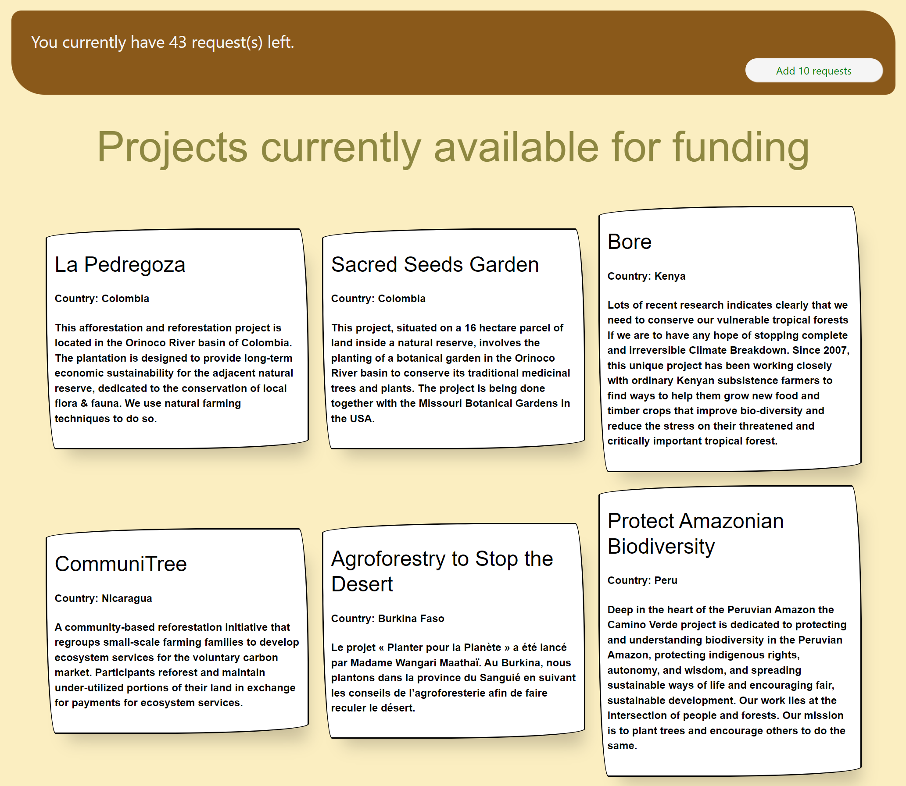
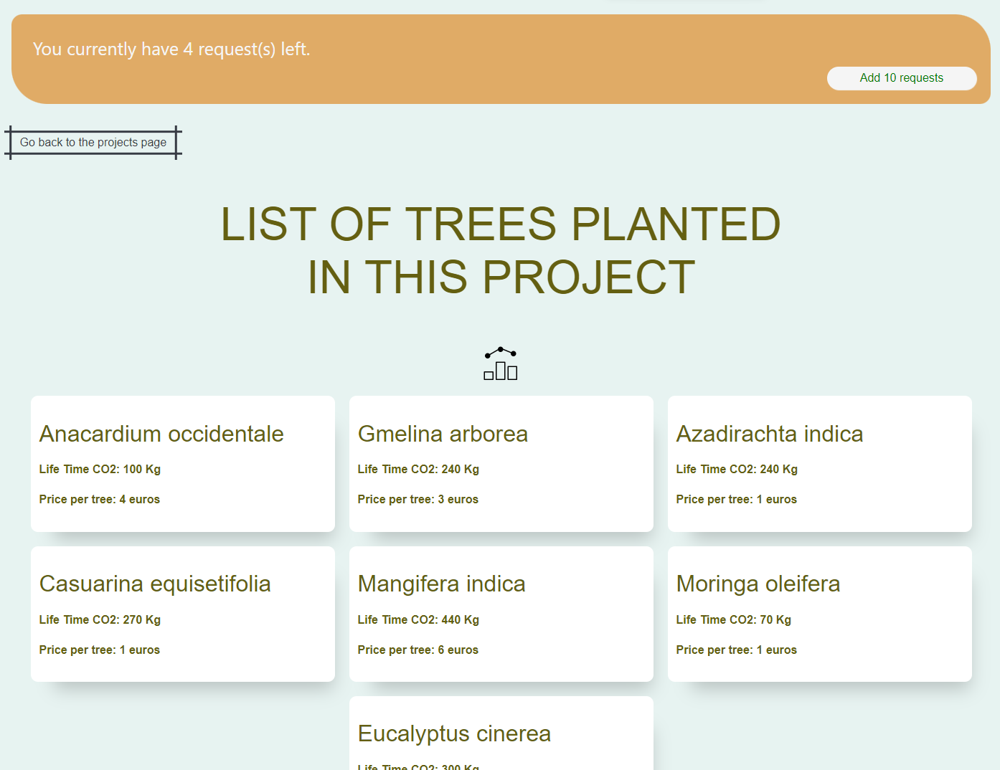
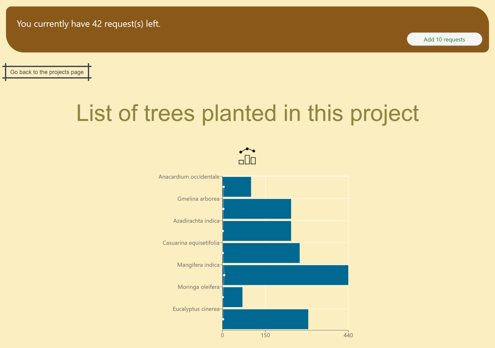
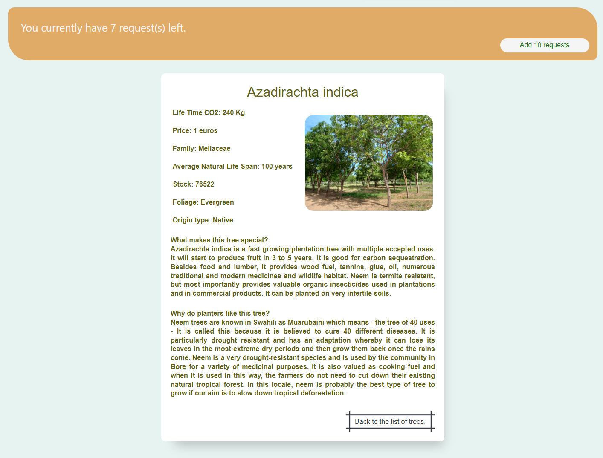

  <h1 align="center">
   Project Treenation 
  </h1>

With this project, my goals were to get more experience using React and Redux. It has also been an apportunity to discover new tools as React Router, Redux Toolkit, Recharts, Styled Components, and use Local Storage.

## Assignment

- Get information from the API treenation about tree species, sites, projects. A first page will show basic information, while the 2nd will display more detailed information.

- A page can be reached from the list view of directly via url (url should contains a unique identifier).

- When data is being fetched, display a loading state.

- Use redux to trigger API calls and store data.

- In a store save a request counter to control how many requests to the API are left, and prepare some user friendly information for user when limit will be reached.

- Handle errors

- Use data visualization

## Screenshots

   

   

   

   

## How I approched the project

1. I started small by creating the first components with React (V18) and fetching data from the API.
   (Treenation: https://documenter.getpostman.com/view/6643991/S17m1X5P#46b02bb7-a0f8-4fd8-9014-e3df21df19fc)

2. Then, I searched how to use React Router by reading the documentation and tutorials.
   I used the last version of React Router, 'CreateBrowserRouter', and 'Link' components.
   At this stage, I added the loading spinner and error page.

3. Implemented Redux toolkit, using RTK Query. I needed to use 'Params hook' to catch the ID of project/tree in the URL and pass it as parameter to fetch data.
   I used Redux as well to keep count of the potentiel numbers of calls left to the API. (this last part does need to be improved to implement the count on the API calls, it is currently dependent on the interactions with buttons.)

4. Added some Data visualisation using Rechart + the option to hide/show the graph

5. Finally, started styling. I heard about Styled Components several times already and was curious to test it out.

## Place for Improvements

- Move the count of API calls on the API calls instead of depnding of the interactions with buttons
- Add a graph using data from two different calls to the API
- Add dropdown menu on 1st page to select projects per country
- Organize the cards by alphabetical order
- Remove useNavigate from the code to keep only Link and prevent an incorrect "go back to previous page"
- Make a better use of Styled Components by searching for good practices
- Improve the design for mobile
- Add the name of the project on the project page
- Add definition of "life time CO2" on hover
